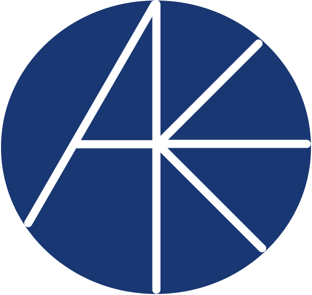

# AppKeep

`npm run dev` to run it.

## **Initial idea**

Keeping track of Job applications.

The goal is to help job seekers to keep track of their applications.

Some functionalities are:
- Add a new application
  - Update status instantly or keep it as a draft
  
- Update application status
  - Draft
  - Submitted 
  - Interview (Multiple stages, can be implemented later on)
  - Accepted
  - Rejected 

Ability to view list of applications and filter them by status. (even a pie chart would be nice)

  
Ability to view list of applications and filter them by date, company name.

Also ability to export the data to a CSV file.

